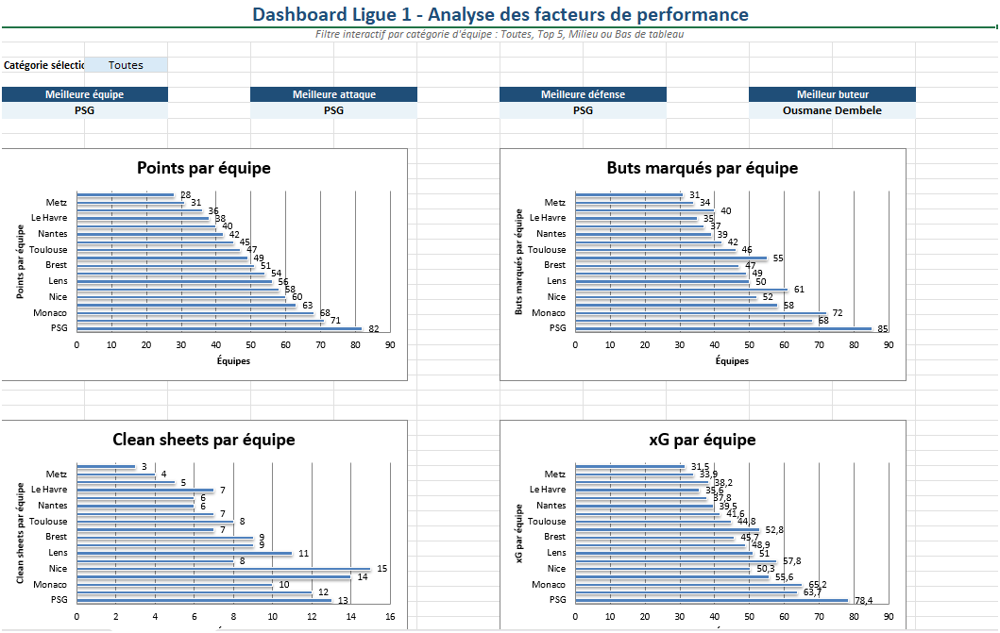
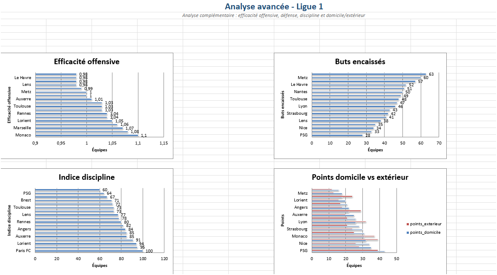

# Dashboard Ligue 1 - Analyse des performances des équipes

## Dictionnaire du jeu de données

Le jeu de données contient différentes statistiques sur les équipes de Ligue 1.

### Variables principales

* **Equipe** : nom de l'équipe
* **Rang** : classement final
* **Points** : nombre de points obtenus
* **Buts_marques** : nombre de buts inscrits
* **Buts_encaisses** : nombre de buts encaissés
* **Clean_sheets** : nombre de matchs sans encaisser de but
* **xG** : buts attendus (*Expected Goals*)
* **Meilleur_buteur** : meilleur buteur de l'équipe
* **Buts_meilleur_buteur** : nombre de buts du meilleur buteur
* **Cartons_jaunes** : nombre de cartons jaunes
* **Cartons_rouges** : nombre de cartons rouges

### Variables calculées

* **Efficacite_offensive** = buts_marques / xG
* **Solidite_defensive** = clean_sheets / journees
* **Indice_discipline** = cartons_jaunes + 3 × cartons_rouges
* **Categorie_equipe** : Top 5, Milieu ou Bas de tableau

---

## Source des données

Les données utilisées proviennent de statistiques qui ont été générés pas l'intelligence artificielle regroupées dans un fichier Excel.

Les données sont stockées sur un espace de stockage **MinIO** et sont récupérées automatiquement lors de l'exécution du projet.

---

## Objectif du projet

L'objectif est de créer un tableau de bord Excel interactif permettant d'analyser les performances des équipes de Ligue 1.

Le dashboard permet notamment :

* d'identifier les meilleures équipes ;
* de comparer les attaques et les défenses ;
* d'analyser les performances des meilleurs buteurs ;
* de comparer les résultats à domicile et à l'extérieur ;
* d'étudier différents indicateurs avancés comme l'efficacité offensive ou la discipline.

Le projet a été développé en **Python** avec les bibliothèques **Pandas** et **OpenPyXL**.

---

## Structure du projet

```text
Projet_Python/
├── images/
│   ├── analyse_avancee.png
│   └── Dashboard_principal.png
│
├── outputs/
│   ├── dashboard_ligue1.xlsx
│   └── Ligue_1_clean.xlsx
│
├── src/
│   └── projet_python/
│       ├── __init__.py
│       ├── analysis.py
│       ├── data_cleaning.py
│       └── export_excel.py
│
├── .gitignore
├── .python-version
├── pyproject.toml
├── README.md
└── uv.lock
```

* **data_cleaning.py** : nettoyage et préparation des données
* **export_excel.py** : génération automatique du dashboard Excel
* **analysis.py** : analyses complémentaires

Le projet utilise une structure **src layout** et la gestion des dépendances est assurée par **uv**.

---

## Pages du dashboard

### Page 1 : Dashboard principal

* Filtre par catégorie d'équipe
* Meilleure équipe
* Meilleure attaque
* Meilleure défense
* Meilleur buteur
* Graphique des points par équipe
* Graphique des buts marqués par équipe



### Page 2 : Analyse avancée

* Efficacité offensive
* Buts encaissés
* Indice de discipline
* Comparaison des performances à domicile et à l'extérieur



---

## Formules utilisées

* SOMME
* MOYENNE
* RECHERCHEV
* SI
* Calculs de ratios
* Agrégations réalisées avec Pandas

---

## Exécution du projet

Installation des dépendances :

```bash
uv sync
```

Nettoyage des données :

```bash
uv run python src/projet_python/data_cleaning.py
```

Génération du dashboard :

```bash
uv run python src/projet_python/export_excel.py
```

Le dashboard final est généré dans :

```text
outputs/dashboard_ligue1.xlsx
```
